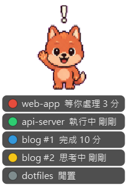
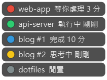

# TerminalPet

監看 Claude Code 狀態的桌面小工具。一個透明、置頂的小視窗，
**每個 Claude Code session 各一個燈**——同時開好幾個終端機時，
瞄一眼就知道是哪個專案在等你批准、哪個已經做完。

> A tiny always-on-top desktop indicator for [Claude Code](https://claude.com/claude-code).
> Each session gets its own light (waiting for approval / done / working / thinking / idle),
> driven by Claude Code hooks. Windows-first (PySide6 + Git Bash); hooks also work on macOS/Linux.
> Install the hooks with `/plugin marketplace add pia8628/TerminalPet`.

<p>

&nbsp;&nbsp;

&nbsp;&nbsp;

</p>

## 兩種外觀

| 啟動方式 | 外觀 | 適用 |
|----------|------|------|
| `run_pet.bat` | 動物版：小狼顯示「最需要你注意」的狀態，下方一排 session 燈 | 個人、療癒 |
| `run_office.bat` | 紅綠燈版：每個 session 一個小圓點 | 辦公室、低調 |

也可用指令啟動（外觀會記住，之後不帶參數就沿用）：
```
python pet.py          # 動物版
python pet.py light    # 紅綠燈版
```

右鍵 →「顯示專案名稱」可把燈列展開成清單（如上圖），等你處理的紅燈會閃爍，
同一個專案開多個 session 會自動編號。
不展開時，滑鼠停在燈上也會顯示該 session 的專案、狀態、經過時間與路徑。

## 狀態對應

| 狀態 | 動物版 | 燈號 | 意思 | 何時消失 |
|------|--------|------|------|----------|
| waiting |  | 🔴 紅（閃爍） | **需要你介入**：等批准、Claude 在問你問題、等你核准計畫 | 你處理之後；不會自己逾時 |
| done |  | 🔵 藍 | 做完了，換你 | 30 分鐘後轉為閒置 |
| working |  | 🟢 綠 | 自己在跑工具 | 10 分鐘沒動靜轉為閒置（多半是被 Esc 中斷） |
| thinking |  | 🟡 黃 | 收到你的指示，思考中 | 同上 |
| idle |  | ⚫ 灰 | 閒置／剛開的 session | 3 小時沒更新自動清掉 |

動物版的小狼取所有 session 中最需要注意的狀態：waiting > done > working > thinking > idle。

## 操作

- **拖曳**：左鍵按住拖動（位置會記住；改變大小時會固定住靠近螢幕邊緣的那一角）
- **點一下跳到終端機**（Windows Terminal）：左鍵點某個 session 的圓點或清單列，直接切到它所在的分頁；
  動物版點小狼，切到最需要你注意的那個 session。跳不過去時（找不到分頁、分頁同名、切換失敗）
  桌寵旁會出現提示，3 秒後自動消失。靠 session 標題比對分頁，剛開、還沒有標題的 session 跳不過去。
- **右鍵選單**：
  - 每個 session 一項：切換到終端機（Windows）、開啟資料夾、從清單移除
  - 清除閒置的 session
  - 外觀（動物版／紅綠燈版）、顯示專案名稱
  - 桌面通知：有 session 需要你或完成時跳 Windows 通知（開啟後會出現系統匣圖示）
  - 開機自動啟動（Windows）
  - 關閉桌寵
- 重複啟動不會開出第二隻，會提示已在執行中。

## 安裝

需要：
- Python 3.10+ 與 PySide6
- Git for Windows（hooks 是 bash 腳本，需要 Git Bash；macOS / Linux 內建 bash 即可）
- 較新版的 Claude Code（用到 `PermissionRequest` 事件與 Notification 的類型 matcher）

### 1. 下載並裝好桌寵

```
git clone https://github.com/pia8628/TerminalPet.git
cd TerminalPet
pip install -r requirements.txt
run_pet.bat          # 或 python pet.py
```

### 2. 安裝 Claude Code hooks（兩種方式擇一）

**方式 A：Claude Code plugin（推薦，不會動到你的 settings.json）**

在 Claude Code 裡執行：
```
/plugin marketplace add pia8628/TerminalPet
/plugin install terminalpet@terminalpet
```

**方式 B：安裝腳本（直接寫進 `~/.claude/settings.json`）**

```
python install.py            # 安裝／更新
python install.py --dry-run  # 只看會改什麼
python install.py --uninstall
```

`install.py` 只動 `hooks` 區塊裡桌寵相關的那幾條，不影響其他既有設定；
寫入前會備份成 `settings.json.terminalpet.bak`。重複執行是安全的（冪等）。

裝完後要**重啟 Claude Code session**（或開一次 `/hooks`）新的 hooks 才會生效。
從舊版升級時也要更新 hooks（重跑 `install.py`，或在 Claude Code 更新 plugin），
「點一下跳到終端機」才找得到 session 對應的分頁。
桌寵本身沒開時，hooks 只是寫幾個小檔案，不影響 Claude Code 運作。

## 運作方式

```
Claude Code hooks ──bash pet-state.sh <狀態>──▶ ~/.terminalpet/sessions/<session_id>.json
  （async，不拖慢工具呼叫）                         │  每個 session 一個檔，原子寫入
                                                   │  內含狀態、專案名稱(cwd)、時間戳記、對話紀錄檔路徑
                               pet.py 監看資料夾（QFileSystemWatcher + 250ms 輪詢兜底）
                               每個 session 一個燈，依開始時間排序
```

| Hook 事件 | 狀態 | 說明 |
|-----------|------|------|
| SessionStart | idle | 新 session 一開就出現在燈列 |
| UserPromptSubmit | thinking | |
| PreToolUse | working | `AskUserQuestion` / `ExitPlanMode` 改判 waiting |
| PostToolUse | working | 批准後工具跑完，紅燈切回綠燈 |
| PermissionRequest | waiting | 權限對話框出現的當下 |
| Notification | waiting | 只認 `permission_prompt`、`elicitation_dialog`、`agent_needs_input`，閒置提醒不算 |
| Stop | done | |
| SessionEnd | （刪除） | session 從燈列移除 |

`pet-state.sh` 全程用 bash 內建指令（Windows Git Bash 上每個外部程式約 50–80ms），
並以微秒時間戳記拒絕亂序的舊事件，避免 async hook 晚到把紅燈蓋掉。

點一下跳到終端機時，桌寵會讀對話紀錄檔最後 1 MB 裡的 session 標題（只讀標題，不讀對話內容），
再用 Windows UI Automation 找出同名的 Windows Terminal 分頁切過去。

終端機直接關掉時 SessionEnd 不會觸發，那個 session 會依上表逾時轉灰、最後被清掉，
也可以右鍵「從清單移除」。

### 手動測試

`set_state.py` 會寫假 session（名稱以 `manual` 開頭），不必真的開 Claude Code：

```
python set_state.py waiting
python set_state.py working --session b --project 另一個專案
python set_state.py clear    # 清掉所有假 session
```

## 待辦

- [x] 動物版換成原創小狼像素圖（`assets/wolf_*.png`，橘色 Q 版）
- [x] 多 session 個別顯示、開機自動啟動、桌面通知
- [x] 點擊 session 跳到對應的終端機視窗／分頁（Windows Terminal）
- [ ] 偵測 Claude 程序已結束（終端機直接關掉）時立即移除
- [ ] 小狼改 2 格輪播做出動畫感
- [ ] 打包成 `pipx install` 或單一 exe，免裝 Python

## 設計參考

開發時參考過這些同類開源專案的做法（未使用其程式碼）：

- [clawd-on-desk](https://github.com/rullerzhou-afk/clawd-on-desk)：hook 直接驅動、輪詢只當備援
- [Claude Status Bar](https://github.com/m1ckc3s/claude-status-bar)：聚合燈＋所有 session 清單、waiting 永遠優先
- [Claude Usage Monitor for Windows](https://github.com/sr-kai/claudeusagewin)：每個 session 一個圓點
- [ccmonitor](https://github.com/martinwickman/ccmonitor)：以 Claude Code plugin marketplace 發佈 hooks

## 授權

[MIT License](LICENSE)。小狼圖（`assets/wolf_*.png`）為本專案以 AI 生成的原創圖，隨專案以同一授權釋出。
